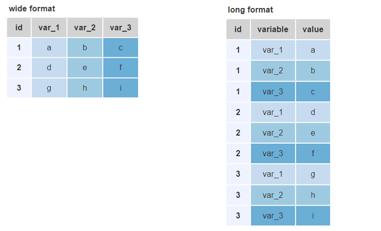

```{r setup, include=FALSE}
knitr::opts_chunk$set(echo = TRUE, 
                      message = FALSE, 
                      warning = FALSE,
                      comment = NA)

library(tidyverse)
d <- rio::import("data/hta.xlsx", sheet = "data") 

```


## Wide and long data 

<center>

</center>


## Wide to long

`pivot_longer(data, cols, names_to = "name",`  
&nbsp;&nbsp;&nbsp;&nbsp;&nbsp;&nbsp;&nbsp;&nbsp;&nbsp;&nbsp;
&nbsp;&nbsp;&nbsp;&nbsp;&nbsp;&nbsp;&nbsp;&nbsp;&nbsp;&nbsp;
&nbsp;&nbsp;&nbsp;&nbsp;&nbsp;&nbsp;&nbsp;&nbsp;&nbsp;&nbsp;
&nbsp;&nbsp;&nbsp;&nbsp;&nbsp;&nbsp;&nbsp;&nbsp;&nbsp;&nbsp;
&nbsp;&nbsp;&nbsp;&nbsp;&nbsp;&nbsp;&nbsp;&nbsp;&nbsp;&nbsp;
`values_to = "value", ...)`

```{r}

d %>% 
  select(pid, sbp_v1:dbp_v6) %>%
  pivot_longer(sbp_v1:dbp_v6)  %>% 
  head()

```


## Wide to long: omitting `NA`s

```{r}

d_long <- d %>% 
  select(pid, sbp_v1:dbp_v6) %>%
  pivot_longer(sbp_v1:dbp_v6)  %>% 
  na.omit() 

head(d_long)

```


## Wide to long: custom names

```{r}

d_long2 <- d %>% 
  select(pid, sbp_v1:dbp_v6) %>%
  pivot_longer(sbp_v1:dbp_v6, names_to = "var", values_to = "bp")  %>% 
  na.omit() 

head(d_long2)

```


## Split a variable into several vars

`separate(data, col, into, ...)`

```{r}
d_long3 <- d %>% 
  select(pid, sbp_v1:dbp_v6) %>%
  pivot_longer(sbp_v1:dbp_v6, names_to = "var", values_to = "bp")  %>% 
  na.omit() %>% 
  separate(var, into = c("variable", "visit")) 

head(d_long3, 4)

```


## Long to wide

`pivot_wider(data, names_from = name,`  
&nbsp;&nbsp;&nbsp;&nbsp;&nbsp;&nbsp;&nbsp;&nbsp;&nbsp;&nbsp;
&nbsp;&nbsp;&nbsp;&nbsp;&nbsp;&nbsp;&nbsp;&nbsp;&nbsp;&nbsp;
&nbsp;&nbsp;&nbsp;&nbsp;&nbsp;&nbsp;&nbsp;&nbsp;&nbsp;&nbsp;
&nbsp;&nbsp;&nbsp;&nbsp;&nbsp;&nbsp;
`values_from = value, ...)`


```{r}

d_long %>% 
  pivot_wider() %>% 
  head()

```

## Long to wide: custom names

```{r}

d_long2 %>% 
  pivot_wider(names_from = var, values_from = bp) %>% 
  head()

```


## Combine several vars into a single var

`unite(data, newcol, cols_to_unite, ...)`

```{r}
d_long3 %>% 
  unite(var_and_visit, variable, visit) %>% 
  head()
```


## Exercises

1. Create dataframe `drugs` with `pid` and all drug treatment variables (`bb` to `other`) in long format.
1. Same, but the resulting dataframe should have variables `pid`, `drug`, and `prescribed`.
1. Same but keeping only the rows of drugs that were prescribed, and variables `pid` and `drug` only. 
1. Create dataframe `bp` with all blood pressure measurements in a long format, having variables `pid`, `sbp`, `dbp`,  and `visit`, and create an indicator variable of BP control, defined as SBP < 120 and DBP < 90. 

