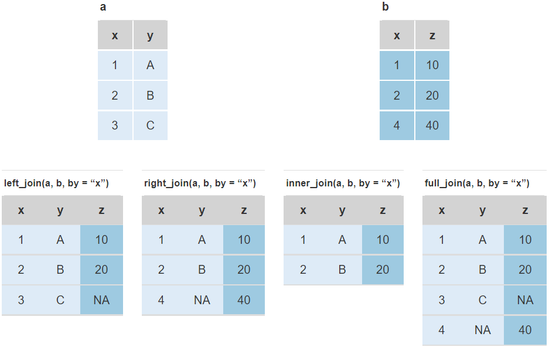

```{r setup, include=FALSE}
knitr::opts_chunk$set(echo = TRUE, 
                      message = FALSE, 
                      warning = FALSE,
                      comment = NA)

```


## Data

```{r}
library(tidyverse)
d <- rio::import("data/hta.xlsx", sheet = "data") 

demo <- select(d, pid, age, sex) %>% na.omit()

diag <- select(d, pid, starts_with("dx_")) %>% na.omit()

bp <- select(d, pid, contains("bp_v")) %>% 
  pivot_longer(sbp_v1:dbp_v6) %>% 
  separate(name, into = c("var", "visit")) %>% 
  pivot_wider(names_from = var) %>% 
  na.omit()

# rows in each dataframe
c("demo" = nrow(demo), "diag" = nrow(diag), "bp" = nrow(bp))

```

## Joins

```{r echo = FALSE, out.width="80%", fig.align='center'}

```

## General syntax

`*_join(data1, data2, by = "keyvar", ...)`

\

- `left_join(a, b, by ="x")` returns all rows in `a` and matching rows in `b`.

- `right_join(a, b, by ="x")` returns all rows in `b` and matching rows in `a`.

- `inner_join(a, b, by ="x")` returns all matching rows.

- `full_join(a, b, by ="x")` returns all rows in `a` and `b`.

\

If `by = "keyvar"` is ommitted, rows are matched on all common vars (having the same name in both dataframes), and a message is issued.


## Left join

```{r message=TRUE}
dd <- left_join(demo, diag, by = "pid") 
head(dd)
nrow(dd)
```


## Right join


```{r message=TRUE}
dd <- right_join(demo, diag) 
head(dd)
nrow(dd)
```


## Inner join

```{r message=TRUE}
dd <- inner_join(demo, diag, by = "pid") 
head(dd)
nrow(dd)
```


## Full join

```{r message=TRUE}
dd <- demo %>% full_join(diag, by = "pid") 
head(dd)
nrow(dd)
```


## More than one row per case

```{r}
demo %>% 
  left_join(bp) %>% 
  head()
```


## Binding rows

`bind_rows(data1, data2, ...)`

```{r}
d1 <- slice(demo, 1:200)
d2 <- slice(demo, 201:491)

nrow(d1); nrow(d2)               # rows in d1 and d2

bind_rows(d1, d2) %>% nrow()     # rows in the resulting dataframe
```


## Exercises

1. Starting from dataframe `bp`  (with vars `pid`, `visit`, `sbp`, `dbp`),  create new dataframe `bp_monitoring`, with one row per patient and two variables: `pid` and `num_bpm`, the number of visits in which BP was measured.

1. Create a new dataframe `drugs`, with one row per patient and two variables: `pid` and `num_drugs`, the number of drugs a patient has been prescribed.

1. Create dataframe `demo` with variables `pid`, `age`, `sex` and `region`.

1. Combine all three dataframes into a single dataframe having 500 rows.

